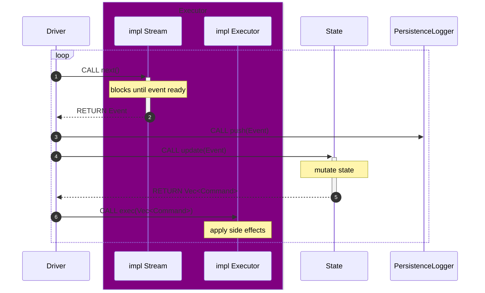

# Monad BFT

## Overview

This repository contains implementation for the Monad consensus client and JsonRpc server. Monad consensus collects transactions and produces blocks which are written to a ledger filestream. These blocks are consumed by Monad execution, which then updates the state of the blockchain. The [triedb](monad-triedb/README.md) is a database which stores block information and the blockchain state.

## Getting Started

From within the `monad-bft` root directory, initialize and update submodules.

```sh
git submodule update --init --recursive
```

Setup the required hugepages and networking configuration.

```bash
# Hugepages allocation
sudo sysctl -w vm.nr_hugepages=2048
# UDP buffer sizes
sudo sysctl -w net.core.rmem_max=62500000
sudo sysctl -w net.core.rmem_default=62500000
sudo sysctl -w net.core.wmem_max=62500000
sudo sysctl -w net.core.wmem_default=62500000
# TCP buffer sizes
sudo sysctl -w net.ipv4.tcp_rmem='4096 62500000 62500000'
sudo sysctl -w net.ipv4.tcp_wmem='4096 62500000 62500000'
```

To make these persistent, you can create a custom settings file, e.g. `/etc/sysctl.d/99-custom-monad.conf` with the following settings:

```bash
# Huge Pages Configuration
vm.nr_hugepages = 2048

# UDP Buffer Sizes
net.core.rmem_max = 62500000
net.core.rmem_default = 62500000
net.core.wmem_max = 62500000
net.core.wmem_default = 62500000

# TCP Buffer Sizes
net.ipv4.tcp_rmem = 4096 62500000 62500000
net.ipv4.tcp_wmem = 4096 62500000 62500000
```

Apply these changes if needed.

```bash
sudo sysctl -p /etc/sysctl.d/99-custom-monad.conf
```

### Using Docker

The most straightforward way to start a consensus client + an execution client + a JsonRpc server.

#### Requirements

* x86 processor - the Monad client is developed exclusively against x86 processors. Emulation techniques for other processors, e.g. ARM (Macbooks) are possible but not supported here
* 4+ physical cores (building times will be faster with more cores and higher clock speed)
* 60 GB+ available hard drive space - Docker builds are about 500 MB each, but the build cache can consume 50 GB+.

#### Instructions

After successfully cloning the `monad-bft` repo, run the following from the `monad-bft` directory:

1. `cd docker/single-node`
2. `nets/run.sh`

This script builds the docker images from source, which can take 500s+ depending on available memory and cores.  This will construct a build folder `docker/single-node/logs/$(date +%Y%m%d_%H%M%S)-$rand_hex"` and run `docker compose up` on the execution, consensus and rpc images.

This will start a single node with chain ID of `20143` and RPC at `localhost:8080`. The known [Foundry/Anvil accounts](https://getfoundry.sh/anvil/overview/) have each been loaded with [large initial balances](https://github.com/category-labs/monad/blob/ce4101b11701bf4ef3a9cd996a6144883735187f/category/execution/monad/chain/monad_devnet_alloc.hpp#L22). The easiest way to fund transactions is to import the private key from one of those pre-allocated accounts.

> [!TIP]
> To avoid a lengthy rebuild after shutting down the docker containers, you can call `nets/run.sh` with the `--cached-build <full path to build dir>` arg, e.g.
>
> ```bash
> single-node$ nets/run.sh --cached-build [...]/monad-bft/docker/single-node/logs/20250929_082118-2d71738c8dfba6d2
> ```

To test the RPC connection, try the following query:

```bash
curl -X POST http://localhost:8080 \
  -H "Content-Type: application/json" \
  --data '{"jsonrpc":"2.0","method":"eth_chainId","params":[],"id":1}'
```

This should return `{"jsonrpc":"2.0","result":"0x4eaf","id":1}`, which [converts](https://www.rapidtables.com/convert/number/hex-to-decimal.html?x=4EAF) to 20143.

Please consult the [official RPC docs](https://docs.monad.xyz/reference/) as there are small differences between Monad and Ethereum JSON-RPC.

### Using Cargo

To run a Monad consensus client, follow instructions [here](monad-node/README.md).
 
To run a JsonRpc server, follow instructions [here](monad-rpc/README.md).

## Architecture



[tests-badge]: https://github.com/monad-crypto/monad-bft/actions/workflows/randomized.yml/badge.svg?branch=master
